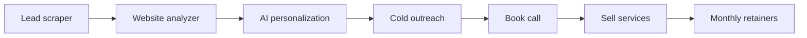

# Atomic Leads — Progress Tracker

> Lead scraping + outreach automation for local businesses (SEO, WordPress, automation retainers).
> Last updated: **2026-05-27**

---

## Project overview

**Goal:** Automate finding local businesses, auditing their websites, personalizing outreach, and converting replies into paying clients (SEO, redesigns, maintenance, AI automation).

**Repo layout**

| Path | Role |
|------|------|
| `atomic-leads/` | Next.js dashboard + API scaffold (paused until Python pipeline is ready) |
| `services/scraper/` | Python + Playwright Google Maps scraper |
| `services/analyzer/` | Website auditor (reads scraper JSONL) |
| `PROGRESS.md` | This file — roadmap and status |

**Current state (honest snapshot):** **Scraper + analyzer v0 working** (Maps → JSONL → audit JSON). Next.js dashboard and Postgres paused. AI copy and outreach not started.

---

## Automation funnel



| Stage | MVP deliverable | Status |
|-------|-----------------|--------|
| 1. Scraper | Python + Playwright → name, website, phone, email, city, rating | **v0 done** (Google Maps) |
| 2. Analyzer | JSON audit (SSL, speed, meta, mobile, CTA, etc.) | **v0 done** |
| 3. AI copy | OpenAI prompts from audit issues | **v0 done** |
| 4. Outreach | Resend / Instantly / SMTP with rotation + throttling | Not started |
| 5. CRM | Track opens, replies, calls, closed deals | Partial (schema only) |
| 6. Dashboard | View leads, jobs, campaigns | Scaffold only |

---

## What’s built today (`atomic-leads/`)

### Done

- [x] **Next.js 16** App Router + TypeScript + Tailwind + shadcn/ui component library
- [x] **Clerk** auth — sign-in, sign-up, `proxy.ts` middleware, protected `/dashboard`
- [x] **TanStack Query** — health check demo on home page
- [x] **React Hook Form + Zod** — lead form validation (client-only submit → toast)
- [x] **Prisma + PostgreSQL** — `Lead` model with `LeadStatus` enum (`NEW` → `DISQUALIFIED`); local Docker, prod-ready
- [x] **Pusher** — Channels + Beams helper modules (not used in features yet)
- [x] **`GET /api/health`** — API smoke test
- [x] Routes: `/` (scaffold), `/dashboard` (placeholder), auth pages

### Not done (core product)

- [x] Python scraper service (Playwright) — `services/scraper/`
- [ ] Scrape jobs API + queue (Celery / Redis / BullMQ)
- [x] Website analyzer (HTTP checks, HTML parsing) — `services/analyzer/`
- [x] OpenAI integration for email copy — `services/outreach/`
- [ ] Email sending (Resend / Instantly) + warmup / rotation
- [ ] Lead CRUD API wired to Prisma
- [ ] Import scraped rows into DB
- [ ] Campaign + sequence models
- [ ] Reply / open tracking webhooks
- [ ] Dashboard: lead table, scrape runs, audit viewer, outreach status

---

## Tech stack — planned vs actual

| Layer | Plan (v1 doc) | Actual in repo | Notes |
|-------|---------------|----------------|-------|
| Scraping | Python + Playwright | **`services/scraper/`** | `atomic-scrape maps` CLI |
| Backend jobs | Celery / Redis | — | Can start with simple cron + scripts |
| Database | PostgreSQL | **PostgreSQL** via Prisma + Docker Compose locally | Same DB in prod |
| AI | OpenAI API | **`services/outreach/`** | `atomic-outreach draft` |
| Dashboard | Next.js | **Next.js 16** | In progress |
| Outreach | Resend / Instantly | — | |
| Auth | — | **Clerk** | Extra vs minimal v1; keep |

---

## Data model — today vs needed

**Today (`prisma/schema.prisma`):**

- `Lead`: `fullName`, `email`, `companyName`, `status`, timestamps

**Needed for MVP pipeline:**

- [ ] `Business` — scraped fields: name, website, phone, email, city, source, googleRating
- [ ] `ScrapeJob` — niche, location, source, status, counts
- [ ] `WebsiteAudit` — businessId, issues[], scores, raw JSON, auditedAt
- [ ] `OutreachMessage` — leadId, subject, body, channel, sentAt, providerId
- [ ] `Campaign` — niche, daily limit, template, active
- [ ] Extend `LeadStatus` — e.g. `AUDITED`, `EMAILED`, `REPLIED`, `CALL_BOOKED`, `WON`, `LOST`

---

## Phased roadmap

### Phase 1 — First paying clients (manual + scripts)

**Target niches:** salons, movers, contractors, restaurants (local service businesses you know).

| Task | Status | Owner notes |
|------|--------|-------------|
| Pick one niche + one city | ⬜ | e.g. roofing TX, salons Austin |
| Manual scrape test (50 businesses) | ⬜ | Validate data quality before automation |
| Define audit checklist (10–15 checks) | ⬜ | Sales angle = issues list |
| Write 2 email templates + AI prompt | ⬜ | |
| Send 20–50 emails/day (one warmed domain) | ⬜ | Opt-out, CAN-SPAM basics |
| Track in spreadsheet or Notion | ⬜ | Until CRM API exists |

### Phase 2 — Automate core loop

| Task | Status |
|------|--------|
| Playwright Google Maps scraper | ✅ v0 |
| Store results in PostgreSQL | ⬜ |
| Analyzer script → JSON issues | ✅ v0 (`atomic-audit run`) |
| OpenAI email from audit JSON | ⬜ |
| Resend/Instantly send + daily cap | ⬜ |
| Next.js: lead list + audit detail page | ⬜ |

### Phase 3 — Scale + retainers

| Task | Status |
|------|--------|
| Multiple inboxes + rotation | ⬜ |
| Domain warmup playbook | ⬜ |
| Reply detection + status updates | ⬜ |
| Call booking link (Cal.com) | ⬜ |
| Service packages: SEO, maintenance, AI content | ⬜ |

---

## Revenue & funnel metrics (fill in weekly)

_Use this to see if volume or conversion is the bottleneck._

| Metric | Target (example) | Week of _____ |
|--------|------------------|---------------|
| Businesses scraped / day | 500 | |
| Emails sent / day | 500 | |
| Open + reply rate | ~5% replies | |
| Replies → calls | ~20% | |
| Calls → closed | ~20% | |
| New clients / month | 2+ | |
| Avg deal | $500 site OR $300/mo SEO | |
| MRR from retainers | | |

**Example math:** 500 emails → 25 replies → 5 calls → **1 client/day** at those rates (adjust to reality).

---

## What to sell (positioning)

- [ ] Finalize offer — **not** “I build websites” but “more leads + ranking + automation”
- [ ] Packages drafted: SEO retainer, maintenance, AI content, GBP/reviews
- [ ] One-page audit PDF or Loom template for follow-ups

---

## Outreach & compliance checklist

- [ ] Physical mailing address + opt-out in emails (US)
- [ ] Reasonable daily send limits per domain
- [ ] Multiple domains / inboxes before scaling (no 10k from one Gmail)
- [ ] Only business-contact data from public listings
- [ ] GDPR awareness if targeting EU
- [ ] Honest personalization (real audit findings, not fake “I saw you at…”)

---

## Environment & ops

| Variable (see `.env.example`) | Purpose | Configured |
|------------------------------|---------|------------|
| Clerk keys | Auth | ⬜ verify locally |
| `DATABASE_URL` | PostgreSQL (local Docker / prod host) | ⬜ verify locally |
| Pusher | Realtime (future) | ⬜ |
| OpenAI | AI copy | ⬜ not in example yet |
| Resend / email API | Outreach | ⬜ not in example yet |

**Run locally**

```bash
cd atomic-leads
cp .env.example .env   # fill values
npm install
npm run db:up
npm run prisma:migrate
npm run prisma:generate
npm run dev
```

---

## Suggested next 5 tasks (priority order)

1. **Extend Prisma schema** — `Business`, `WebsiteAudit`, scrape-friendly fields on `Lead`
2. **`POST /api/leads`** — wire `LeadForm` to Prisma (replace toast-only submit)
3. **Python scraper v0** — Playwright, one query, export CSV → import script
4. **Analyzer v0** — SSL, title/meta, mobile viewport, response time → JSON file
5. **One campaign manually** — 50 leads, AI emails, Resend, track statuses in DB

---

## Changelog

| Date | Update |
|------|--------|
| 2026-05-27 | Initial progress doc; codebase reviewed — scaffold only, funnel steps not implemented |
| 2026-05-27 | Switched Prisma from MongoDB to PostgreSQL; added `docker-compose.yml` for local dev |
| 2026-05-27 | Added `services/scraper/` — Google Maps CLI, JSONL/CSV export |
| 2026-05-27 | Added `services/analyzer/` — `atomic-audit run` on scraper JSONL |
| 2026-05-27 | Shared `atomic_models`; outreach + `atomic-pipeline run` |
| 2026-05-29 | P0: chain/social detection, contact email finder, outreach pitch types |
| 2026-05-29 | P1 audit: LocalBusiness schema, WordPress, copyright, contact page checks |

---

## Links & references

- App README: `atomic-leads/README.md`
- Prisma schema: `atomic-leads/prisma/schema.prisma`
- Home scaffold: `atomic-leads/components/dashboard/lead-engine-scaffold.tsx`
